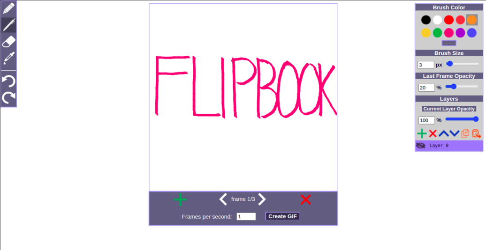

# Flipbook Animator
A simple online animation and drawing tool made with React
https://cfreeman01.github.io/flipbook-animator-2/
 
 
 
## Features
  - :hammer_and_wrench: Four different tools: Pencil, pen, eraser, and dropper
  - :paintbrush: Change brush size and color
  - :leftwards_arrow_with_hook: Undo and redo functionality
  - :memo: Layer system:
    - Add and remove layers
    - Move layers
    - Rename layers
    - Copy and paste layers
    - Change layer opacity
    - Hide and unhide layers
   - :film_projector: Choose framerate for your animation
   - :film_strip: Download your animation as a GIF
##
GIF rendering handled by [jsgif](https://github.com/antimatter15/jsgif)

